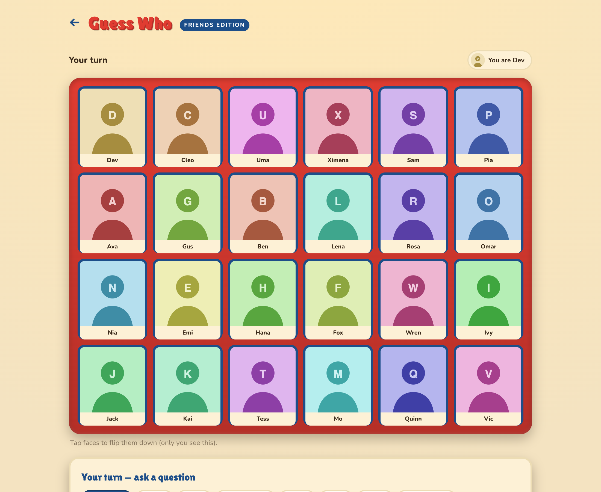

# Guess Who — Friends Edition

A [Guess Who](https://en.wikipedia.org/wiki/Guess_Who%3F)–style online game with a
twist: **no physical-appearance questions allowed.** Instead of "do they wear
glasses," you ask about their *soul* — "Would they cry at a stranger's wedding?"
"Are they secretly thrilled when plans get cancelled?" The opponent answers
yes/no from the gut, exactly like the classic board game, and you flip down the
faces that no longer fit.

Play online against a friend on two devices, or solo against a lightweight
built-in opponent.

> The faces in this repo are neutral placeholder avatars. The game is designed
> to be played with cartoon portraits of your *own* friend group — see
> [Making your own faces](#making-your-own-faces).



## How to play

1. **Start a game.** Enter your name and either create a room (share the 4-letter
   code with a friend) or join theirs. No friend around? Hit **Play vs the
   Computer**.
2. **Pick your secret friend.** You each secretly choose one person from the
   shared board of 24. Your opponent has to figure out who *you* picked.
3. **Take turns asking.** On your turn, ask one yes/no question about
   personality — pick from the deck or write your own. The only rule: **nothing
   physical.** No hair, no glasses, no height. Only questions about who they
   *are*.
4. **Answer honestly.** When it's the other player's question, tap **YES** or
   **NO** based on your secret friend. It's subjective and that's the fun.
5. **Narrow it down.** Tap faces to flip them down as you rule people out. Only
   you can see your own flipped board.
6. **Make your guess.** When you think you know, switch to guess mode and tap
   their friend. **Guess right and you win — guess wrong and you lose.** So be
   sure before you commit.

First to correctly guess the other player's secret friend wins. A wrong guess or
a forfeit hands the win to your opponent. Want a rematch? Same friends, same
board, fresh secrets.

## How it works

- **Frontend** (`guess-who/`) — vanilla HTML/CSS/JS, no build step. A single
  page toggles between lobby, pick, game, and end screens. Board flips and
  used-question dimming are stored locally; everything else is
  server-authoritative.
- **Backend** (`functions/api/guess-who/`) — Cloudflare Pages Functions backed
  by a single D1 (SQLite) table. One row per game, mutated with optimistic
  locking (`UPDATE … WHERE code=? AND version=?`). Clients poll for state every
  ~1.5s — turn-based play makes polling indistinguishable from realtime.
- **Solo mode** (`guess-who/ai.js`) — a fully client-side, deterministic
  opponent. It answers your questions and narrows the board with no network
  calls and no external API.

The core game logic lives in pure, unit-tested functions:
`functions/api/guess-who/lib/util.js` (`applyAction` state machine) and
`guess-who/ai.js`.

## Run it locally

Requires **Node.js 22.5+** (for the built-in `node:sqlite` module).

```bash
node dev-server.mjs
# open http://localhost:8788/guess-who/
```

The dev server emulates Cloudflare Pages Functions + D1 using a local SQLite
file in `.wrangler/`. To play a two-player game, open the page in two windows
(one incognito): create a room in one, join with the code in the other.

## Run the tests

```bash
node --test tests/
```

Covers the server state machine (join order, out-of-turn asks, guess
right/wrong, rematch, optimistic-lock conflicts, token tampering) and the solo
opponent.

## Deploy to Cloudflare Pages

1. Create a D1 database and apply the schema:
   ```bash
   npx wrangler d1 create guess-who
   npx wrangler d1 execute guess-who --remote --file schema.sql
   ```
2. Bind the database as `DB` in your Pages project settings (or `wrangler.toml`).
3. Deploy:
   ```bash
   npx wrangler pages deploy .
   ```

## Making your own faces

The magic of this game is recognizing your actual friends. Two scripts in
`scripts/guess-who/` turn photos into a consistent set of flat-color cartoon
avatars:

- **`scrape_faces.mjs`** — an optional Playwright helper for pulling labeled
  face thumbnails out of your own photo library. You can also just drop images
  into `scripts/guess-who/raw_faces/` by hand.
- **`cartoonize.mjs`** — sends each raw photo through the OpenAI image API to
  redraw it as a board-game cartoon avatar, downscales it, and regenerates
  `guess-who/roster.json`.

```bash
OPENAI_API_KEY=sk-... node scripts/guess-who/cartoonize.mjs --test   # first 3
OPENAI_API_KEY=sk-... node scripts/guess-who/cartoonize.mjs          # full batch
```

The game samples 24 people at random from the roster each match, so a roster of
24+ keeps things fresh. Generated faces and raw photos are **git-ignored by
default** — they're personal data. Edit `.gitignore` if you intend to publish
your own set.

## Editing the question deck

`guess-who/questions.json` holds the curated deck, grouped into categories
(self-image, morals, social battery, romance, money, hypotheticals, and more).
Every question is strictly qualitative — the format itself enforces the
"nothing physical" rule. Players can also type their own yes/no question.

## License

MIT — see [LICENSE](LICENSE).
