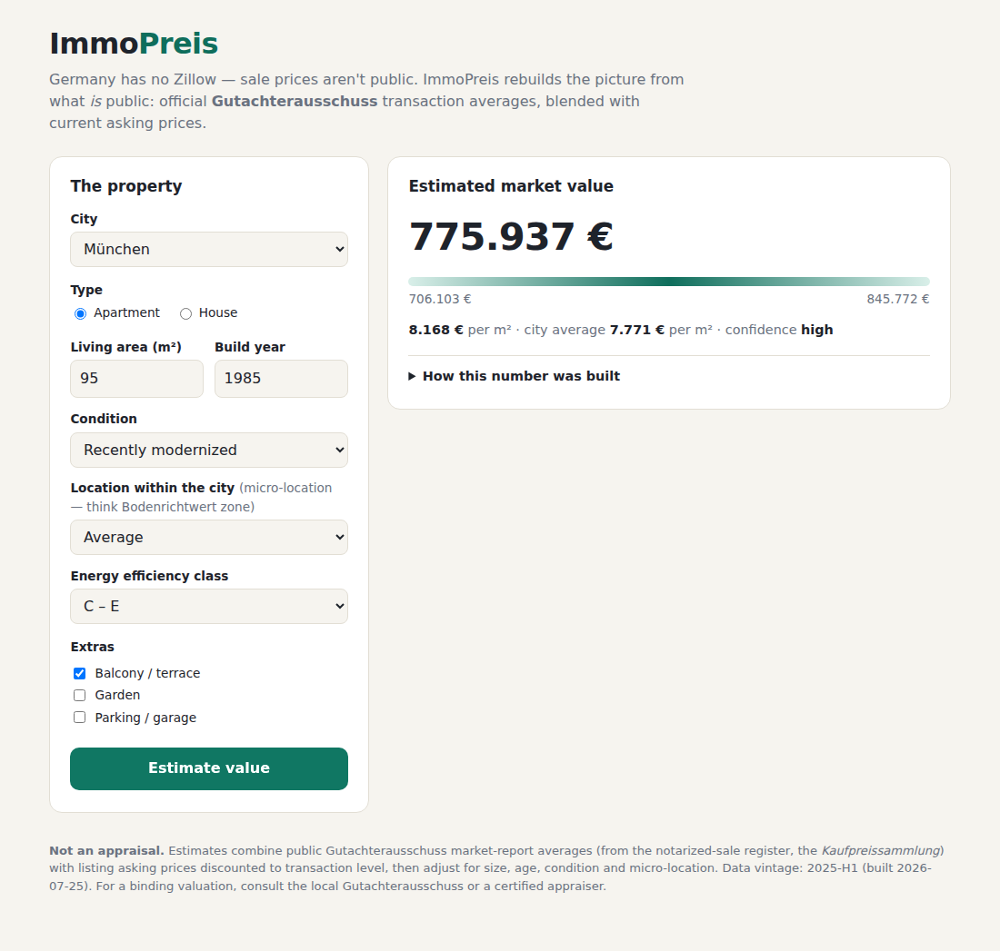

# ImmoPreis — German property price estimator

Live at **pacbrewlab.com/immopreis/** (served as a static folder of this
Cloudflare Pages project — no backend needed).



## Why this exists

In the US, sale prices are public record, which is what makes Zillow/Redfin
possible. In Germany they are not: every sale is notarized and reported to the
local **Gutachterausschuss** (appraisal committee), whose *Kaufpreissammlung*
(purchase-price register) is confidential. What *is* public:

- **Immobilienmarktberichte** — yearly market reports by the
  Gutachterausschüsse with average transaction prices per segment.
- **Bodenrichtwerte (BORIS)** — official standard land values, open data in
  most states ([bodenrichtwerte-boris.de](https://www.bodenrichtwerte-boris.de)).
- **Destatis Häuserpreisindex** — the national price index (trend, not level).
- **Asking prices** — visible on listing portals, but ~asking ≠ sold, and the
  big portals prohibit scraping (see [Legal notes](#legal-notes)).

ImmoPreis rebuilds an estimate from these pieces: it anchors on official
transaction averages where a city's market report is public, blends in
listing-derived asking prices discounted to transaction level, then adjusts
for size, build year, condition, energy class and micro-location.

## How the estimate works

All logic lives in [`estimator.js`](estimator.js) (pure functions, unit tested
in `tests/immopreis.test.mjs`):

1. **Base €/m²** — `0.55 × official + 0.45 × (asking × (1 − 6%))` when both
   sources exist; otherwise whichever is available. Confidence (and the width
   of the returned range) depends on which sources back the number.
2. **Multiplicative adjustments** — condition (0.82–1.08, or ×1.28 for
   new-build first occupancy), micro-location (0.85–1.28), build-year band
   (Altbau premium, 1949–77 discount), size curve (small units cost more per
   m²), energy class, extras.
3. **Range** — ±9% with official anchoring, ±14% listing-only, ±18% for
   state-average fallback.

## Data pipeline

The frontend ships with `data/market.json`, generated by scripts in
[`scripts/immopreis/`](../scripts/immopreis/):

```bash
# 1. (optional) refresh the official side — Destatis trend + hand-maintained
#    Gutachterausschuss averages; prints the per-state report portals
GENESIS_TOKEN=... node scripts/immopreis/fetch_official.mjs

# 2. (optional) ingest listing feeds you are allowed to use
#    (CSV exports, OpenImmo XML, open-data URLs) → per-city medians
node scripts/immopreis/fetch_listings.mjs

# 3. merge everything into the shipped dataset
node scripts/immopreis/build_dataset.mjs
```

Without steps 1–2 the build falls back to the committed seed data
(`sources/*_seed.json`, ~53 cities + 16 state averages, marked approximate,
vintage 2025-H1). Live fetches override seeds city by city.

## Legal notes

- **No portal scrapers are included, on purpose.** ImmoScout24, Immowelt and
  Kleinanzeigen prohibit automated extraction in their terms, and German
  database rights (§87a ff. UrhG) protect their listing databases. The
  listings pipeline instead ingests sources you have rights to: your own or
  partner CSV/OpenImmo exports, research datasets (e.g. RWI-GEO-RED via FDZ
  Ruhr), or genuine open data. The `json-url` adapter checks robots.txt and
  rate-limits to 1 request/second.
- Listings contain personal data (addresses, agent contacts) — the pipeline
  aggregates to city-level medians immediately and stores no raw records.
- The site shows estimates, not appraisals (that's a regulated activity —
  see the footer disclaimer on the page).

## Local development

```bash
node dev-server.mjs
# open http://localhost:8788/immopreis/
```
